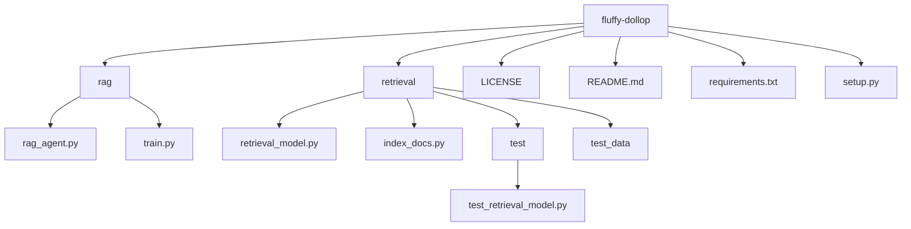

# fluffy-dollop

## Overview
fluffy-dollop is a Retrieval-Augmented Generation (RAG) system that integrates document retrieval with generative models. This project is designed to index and utilize documents (e.g., PDFs) from the `retrieval/test_data` folder and to augment the generation capabilities provided by the RAG agent.

## Project Description
The project is built around two main components:
- **Retrieval Module:** Responsible for indexing and retrieving documents, primarily from `retrieval/test_data`.
- **RAG Agent:** Leverages the retrieved documents to improve text generation results.

The system is structured with a clear separation between document indexing, retrieval logic, and the generation agent.

## Project Structure
Below is an overview of the project directory layout:



## Installation
To set up the project, follow these steps:

1. **Create a new Conda environment for Python 3.10:**
    ```bash
    conda create --name fluffy-env python=3.10
    conda activate fluffy-env
    ```

2. **Install dependencies:**
    ```bash
    pip install -r requirements.txt
    ```

3. **Indexing Documents:**
   - Any document placed in the `retrieval/test_data` folder will be automatically indexed when the indexing script is executed.

## Usage
To use the project features, run the following commands:

- **Index Documents:**
    ```bash
    python retrieval/index_docs.py
    ```

- **Run the RAG Agent:**
    ```bash
    python rag/rag_agent.py
    ```

## Testing
To run the tests, execute the following command in the project directory:
```bash
python -m unittest discover -s retrieval/test
```

## Contributing
Contributions are welcome! Please follow these guidelines:
- Adhere to the project's coding standards.
- Submit a pull request with a clear description of your changes.
- If filing issues, provide detailed information for replication.

## License
This project is licensed under the terms specified in the LICENSE file.

## Acknowledgements
Thanks to all contributors and any external resources that have supported this project.